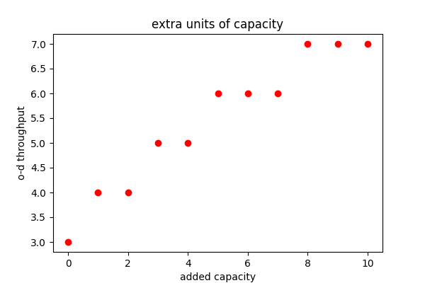

# network-dynamics-simulations

## HOMEWORK 1
-minimum and maximum aggregate capacity to remove from a flow graph with Edmonds-Karp algorithm

-perfect matching with Hall's theorem

-system optimum traffic assigment and user optimum travel assigment solved with convex optimization

## HOMEWORK 2
-simulation of French-DeGroot opinion dynamics on a graph

-simulation of rate-r Poisson process and find expected hitting times for the particles

-simulation of particle and node perspective in continuous and discrete time

## HOMEWORK 3
-simulation of SIR and SIRV disease propagation models on symmetric and random graphs

-simulation of a model able to approximate the trend of H1N1 pandemic in Sweden of 2009 with random graph and a Newmann-Watts-Strogatz graph

-coloring problem applied on a network of routers, where adjacent routers shouldn't use channels with the same frequency bands or one next to each other.

